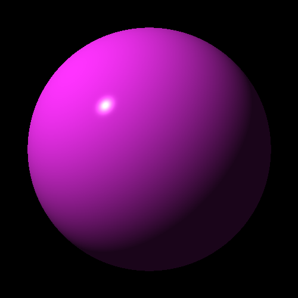
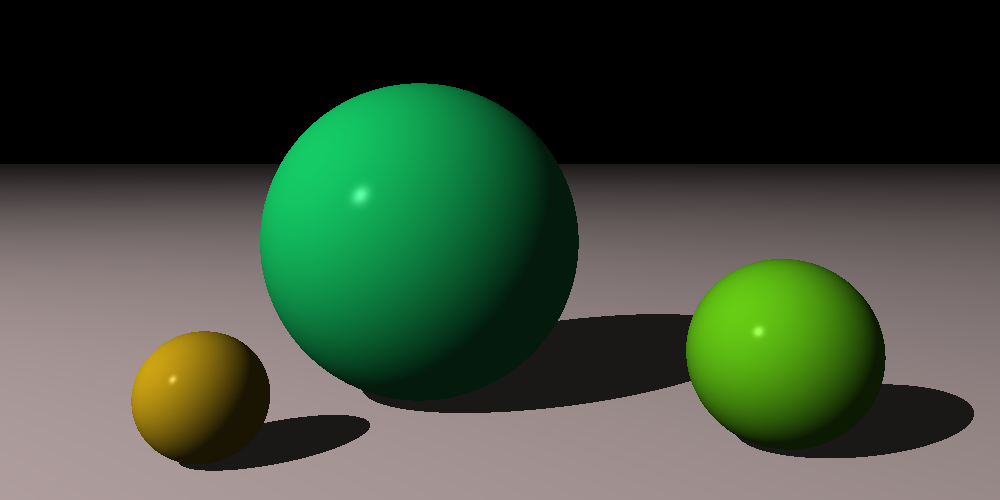
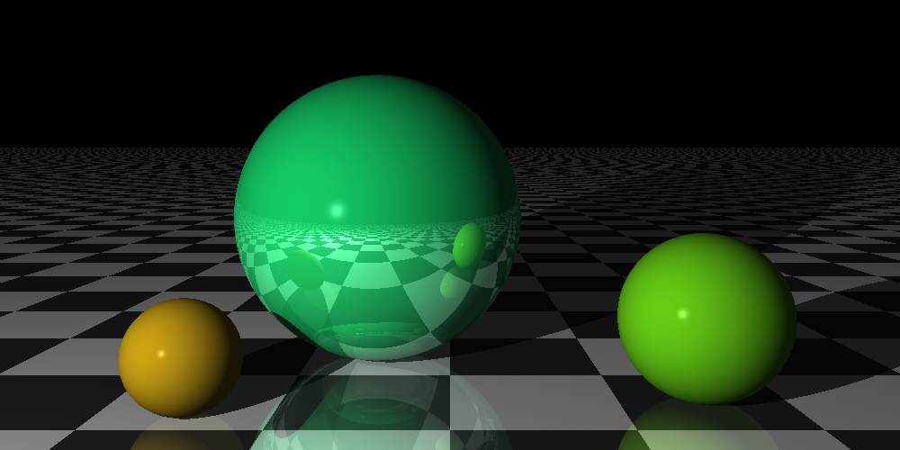
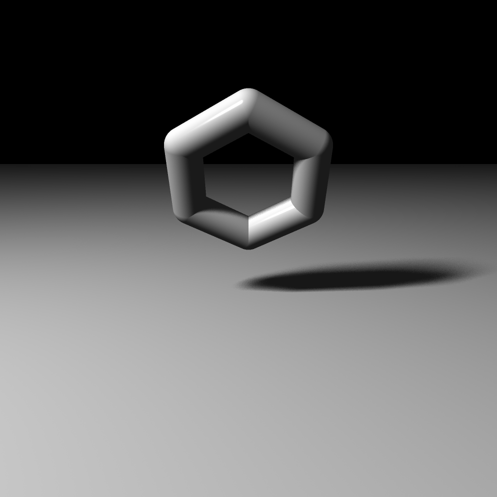
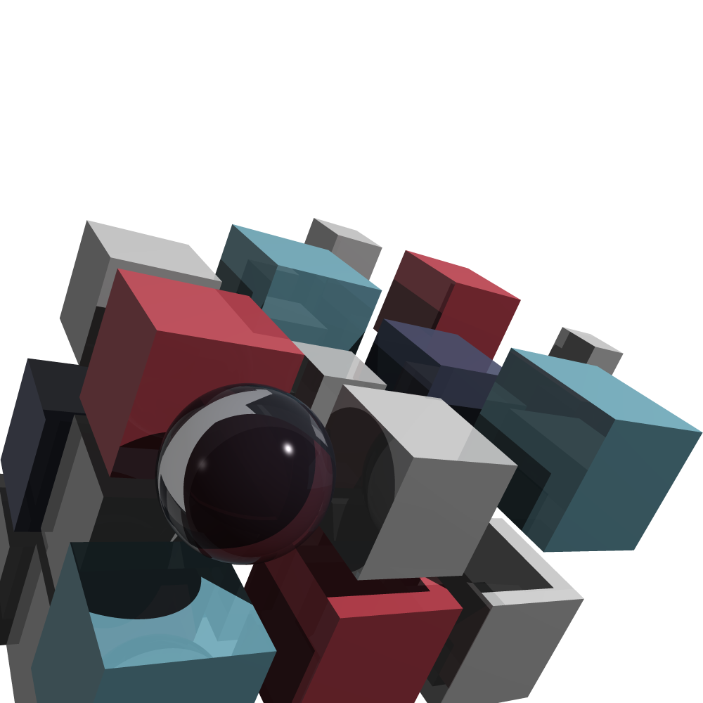
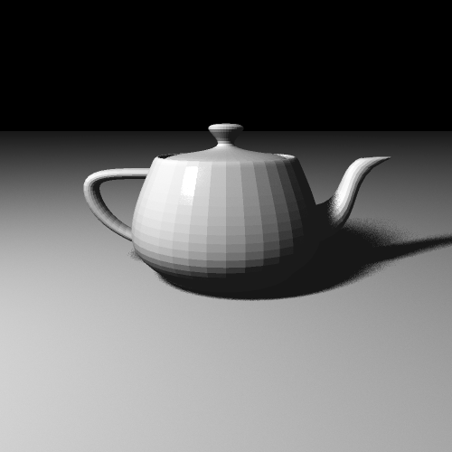

# RayTracerChallenge

A CPU ray tracer written from scratch in C#, following Jamis Buck's
*[The Ray Tracer Challenge](http://raytracerchallenge.com/)*.

The book specifies the renderer entirely through Cucumber-style scenarios and
leaves every implementation decision to the reader. This repository is my
answer to those scenarios: a test-driven build-up from 4-element tuples to a
recursive Whitted-style renderer with reflection, refraction, patterns, and
mesh support.

## Features

**Geometry**

- Spheres, planes, cubes, cylinders, cones, triangles
- Cylinders and cones support truncation (`Minimum` / `Maximum`) and optional end caps
- Groups with arbitrary nesting, so transforms compose down the hierarchy
- Wavefront `.obj` parsing for triangle meshes
  **Shading**

- Phong reflection model — ambient, diffuse, specular
- Multiple light sources per scene (an extension beyond the book, which assumes a single light)
- Hard shadows, with the intersection point nudged along the normal to avoid self-shadowing artifacts
- Recursive reflection and refraction, with refractive index tracking through nested transparent media
- Schlick's approximation for angle-dependent Fresnel blending
  **Patterns**

- Stripes, gradients, rings, checkers
- Patterns carry their own transform, so they can be scaled and rotated independently of the object
  **Camera and output**

- `ViewTransformation(from, to, up)` for arbitrary camera placement
- Supersampled anti-aliasing — multiple rays per pixel, averaged
- PPM output (matching the book's test scenarios) and PNG output for actually looking at the results
  **Performance**

- Parallel rendering across scanlines via `Parallel.For`
- Inverse transformation matrices computed once on assignment rather than per ray
- Value types for tuples, colors, and matrices to keep allocation out of the render loop
## Project layout

```
RayTracerChallenge.sln
├── RayTracer/          Core library — geometry, shading, camera, parser
├── Tests/              xUnit tests mirroring the book's Gherkin scenarios
└── Program.cs          Entry point for rendering sample scenes
```

## Building and running

Requires the .NET SDK.

```bash
git clone <repo-url>
cd RayTracerChallenge
dotnet build -c Release
dotnet run -c Release
```

## Writing a scene

```csharp
var floor = new Plane();
floor.Material = new Material(
    color: new Color(1, 1, 1),
    specular: 0,
    reflective: 0.2);
floor.Material.Pattern = new CheckerPattern(
    new Color(0.15, 0.15, 0.15),
    new Color(0.85, 0.85, 0.85));
 
var glassBall = new Sphere();
glassBall.Transform = Transformations.Translation(-0.5, 1, 0.5);
glassBall.Material = new Material(
    color: new Color(1, 1, 1),
    ambient: 0,
    diffuse: 0,
    specular: 0.9,
    shininess: 300,
    reflective: 0.9,
    transparency: 0.9,
    refractiveIndex: 1.5);
 
var light = new Light(Tuple4.Point(-10, 10, -10), new Color(1, 1, 1));
 
var camera = new Camera(1000, 500, Math.PI / 3);
camera.Transform = Transformations.ViewTransformation(
    Tuple4.Point(0, 1.5, -5),
    Tuple4.Point(0, 1, 0),
    Tuple4.Vector(0, 1, 0));
 
var world = new World(
    new List<Light> { light },
    new List<Shape> { floor, glassBall },
    camera);
 
world.Render().SavePng("./scene.png");
```

## Conventions

Right-handed coordinate system, Y up, camera looking down −Z by default.
Primitives are defined in canonical form and positioned with transformation
matrices: the sphere is a unit sphere at the origin, the cube spans
[−1, 1] on every axis, the plane is the XZ plane at y = 0, and the cylinder
has radius 1 about the Y axis.

## Renders



A sphere with light and shadow



A scene with shadow



Add reflection



Hexagon combined multiple shapes



The book's cover with anti-alias



Teapot model

## Notes on the implementation

A few places where I deviated from the book or had to work something out:

**Multiple lights.** The book's `lighting()` takes a single light. Supporting a
list means the ambient term has to move outside the per-light loop — otherwise
it accumulates once per light and objects get brighter as you add lights, which
is not how ambient light behaves. Shadow testing is also per-light: a point can
be occluded from one source and lit by another.

**Area lights.** Added area light that is basically a rectangle surface that 
projects multiple light rays to a world point. Which can cast a more smooth shadow
edge by adding some random blur. We can define the number of the rays, 2 $\times$ 2 = 4 
rays by default.

**Normal transformation.** Normals transform by the inverse transpose, not the
transformation matrix. With rotation and uniform scaling the two agree, so the
bug stays invisible until the first non-uniform scale — at which point lighting
on stretched spheres goes subtly wrong.

**Nested coordinate spaces.** With groups, a shape's local space can be several
transforms away from world space. Rays descend the hierarchy automatically
through recursive intersection, but normals need an explicit walk back up,
applying each inverse transpose in turn.

## References

- Jamis Buck, *The Ray Tracer Challenge*, Pragmatic Bookshelf, 2019
- Möller & Trumbore, "Fast, Minimum Storage Ray/Triangle Intersection", 1997
- Schlick, "An Inexpensive BRDF Model for Physically-based Rendering", 1994
 